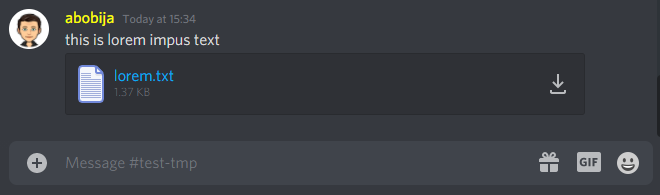

# ESP32 Discord bot download message attachment

This is example application which represent echo [ESP32 Discord bot](https://github.com/abobija/esp-discord) that download attachment of received message.

## Configuration steps:

- Run `./components/esp-discord/certgen.sh` to generate discord certificates
- Run `idf.py set-target esp32`
- Open `idf.py menuconfig` and set next configs:
  - `Example Connection Configuration`
    - \> `WiFi SSID` with your wifi name
    - \> `WiFi Password` with you wifi password
  - `Component Config` > `Discord` > `Token` with your bot authentication token
- Now build, flash and monitor app.

For more examples please visit [esp-discord-examples](https://github.com/abobija/esp-discord-examples) repository or check out official [esp-discord](https://github.com/abobija/esp-discord) component repository.

## Demo



Output:

```
I (7708) discord_bot: Bot ESP32#9421 connected
I (39248) discord_bot: New message (dm=false, autor=abobija#5474, bot=false, channel=808419120159916042, guild=805838862634451014, content=this is lorem impus text)
I (39258) discord_bot: attachment (id=819941452343279687, filename=lorem.txt, type=text/plain; charset=ascii, size=1404, url=https://cdn.discordapp.com/attachments/808419120159916042/819941452343279687/lorem.txt)
I (42018) discord_bot: downloaded 288 [288/1404]
I (42018) discord_bot: Data: [Lorem ipsum dolor sit amet, consectetur adipiscing elit. Aliquam eu molestie enim. Donec neque neque, mattis vulputate lobortis in, congue sit amet mi. Aenean facilisis odio nec ante volutpat, eu porttitor mi pellentesque. Quisque in accumsan nulla. Praesent et lorem nec nisl malesuada u]
I (42038) discord_bot: downloaded 512 [800/1404]
I (42048) discord_bot: Data: [ltricies ultrices sed nunc. Morbi nec volutpat mauris. Sed lorem elit, dapibus at efficitur eget, venenatis ac odio. Suspendisse et lacus ac diam vulputate condimentum nec eu dui. Suspendisse dolor purus, scelerisque in turpis non, rutrum rutrum nisi. Praesent blandit, justo quis egestas varius, metus urna cursus augue, vitae porttitor augue mauris eget leo.

Nulla facilisi. Pellentesque nec ullamcorper lectus. Suspendisse non augue risus. Maecenas eget enim eu ex pulvinar molestie ut vel diam. Pellentesq]
I (42088) discord_bot: downloaded 345 [1145/1404]
I (42098) discord_bot: Data: [ue magna velit, lobortis id pharetra et, laoreet in libero. Mauris ac sodales arcu. Maecenas semper, sapien ac vestibulum sollicitudin, est diam auctor elit, ut molestie turpis metus non leo. Aliquam sit amet varius sem, sit amet maximus mauris. Ut fringilla, tortor ut commodo vulputate, massa dui pellentesque augue, at molestie arcu nisl a di]
I (42138) discord_bot: downloaded 259 [1404/1404]
I (42138) discord_bot: Data: [am. Ut non orci nec felis rutrum tincidunt id non ex. Vestibulum luctus justo non ex fermentum aliquam. Maecenas tristique dui nibh, vitae efficitur lorem mollis sed. Vivamus id nulla erat. Praesent dapibus bibendum ante, ac interdum neque condimentum tempor.]
I (42168) discord_bot: Attachment has been successfully downloaded
```