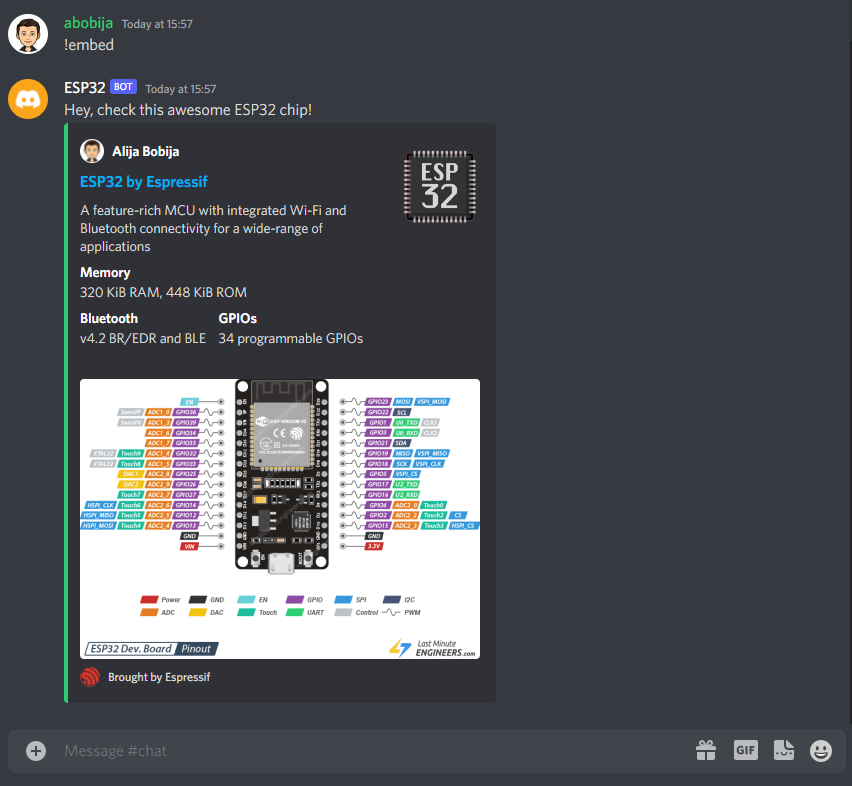

# Esp32 Discord Bot embeds example

This is example of how to make embeds with [ESP32 Discord bot](https://github.com/abobija/esp-discord).

## Configuration steps:

- Run `idf.py set-target esp32`
- Open `idf.py menuconfig` and set next configs:
  - `Example Connection Configuration`
    - \> `WiFi SSID` with your wifi name
    - \> `WiFi Password` with you wifi password
  - `Component Config` > `Discord` > `Token` with your bot authentication token
- Now build, flash and monitor the app.

For more examples please visit [esp-discord-examples](https://github.com/abobija/esp-discord-examples) repository or check out official [esp-discord](https://github.com/abobija/esp-discord) component repository.

## Demo



Output:

```
I (8180) discord_bot: Bot ESP32#0578 connected
I (8180) discord_bot: Send "!embed" message on Discord in order to get embed from the Bot.
I (22310) discord_bot: New message (content=!embed, autor=abobija#5474, bot=false, attachments_len=0, channel=805838862634451017, dm=false, guild=805838862634451014)
I (24810) discord_bot: Message with embed has been sent
```