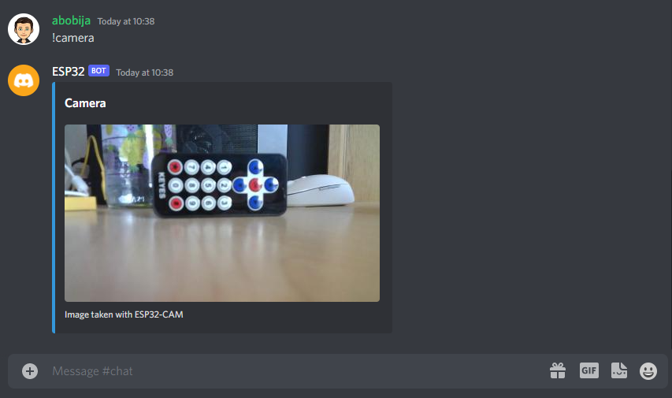

# Esp32 Discord Bot ESP32-CAM example

This is example of [ESP32 Discord bot](https://github.com/abobija/esp-discord) that sends image taken with ESP32-CAM module.

## Configuration steps:

- Run `idf.py set-target esp32`
- Open `idf.py menuconfig` and set next configs:
  - `Example Connection Configuration`
    - \> `WiFi SSID` with your wifi name
    - \> `WiFi Password` with you wifi password
  - `Component Config` > `Discord` > `Token` with your bot authentication token
- Now build, flash and monitor the app.

For more examples please visit [esp-discord-examples](https://github.com/abobija/esp-discord-examples) repository or check out official [esp-discord](https://github.com/abobija/esp-discord) component repository.

## Demo



Output:

```
I (5115) cam_hal: cam init ok
I (5119) sccb: pin_sda 26 pin_scl 27
I (5123) gpio: GPIO[32]| InputEn: 0| OutputEn: 1| OpenDrain: 0| Pullup: 0| Pulldown: 0| Intr:0
I (5162) camera: Detected camera at address=0x30
I (5165) camera: Detected OV2640 camera
I (5165) camera: Camera PID=0x26 VER=0x42 MIDL=0x7f MIDH=0xa2
I (5248) cam_hal: buffer_size: 32768, half_buffer_size: 4096, node_buffer_size: 2048, node_cnt: 16, total_cnt: 45
I (5248) cam_hal: Allocating 184320 Byte frame buffer in PSRAM
I (5255) cam_hal: Allocating 184320 Byte frame buffer in PSRAM
I (5261) cam_hal: cam config ok
I (5265) ov2640: Set PLL: clk_2x: 0, clk_div: 0, pclk_auto: 0, pclk_div: 12
I (7930) discord_bot: Bot ESP32#0578 connected
I (7930) discord_bot: Open Discord and send message "!camera" to get an image.
I (30561) discord_bot: New message (content=!camera, autor=abobija#5474, bot=false, attachments_len=0, channel=805838862634451017, dm=false, guild=805838862634451014)
I (33259) HTTP_CLIENT: Body received in fetch header state, 0x3fff3fe3, 6
I (33262) discord_bot: Image has been successfully sent
```