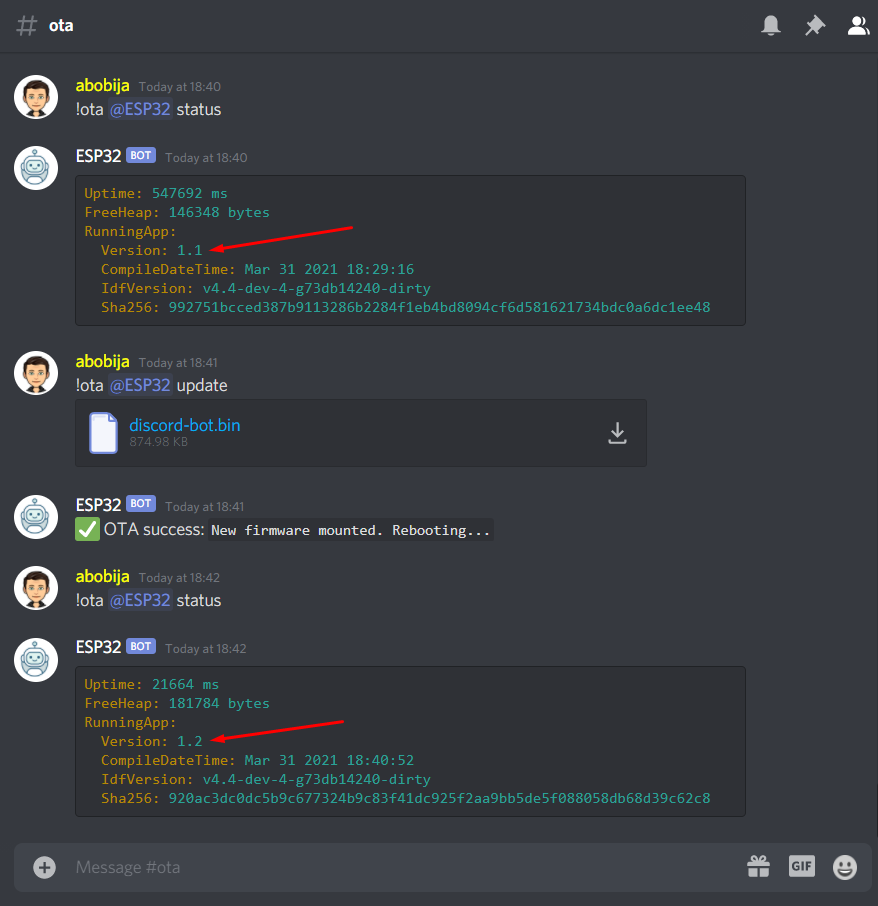

# ESP32 Discord bot OTA update

This is example application which represent [ESP32 Discord bot](https://github.com/abobija/esp-discord) that can perform OTA updates.

## Configuration steps:

- Run `./components/esp-discord/certgen.sh` to generate discord certificates
- Run `idf.py set-target esp32`
- Open `idf.py menuconfig` and set next configs:
  - `Partition Table`
    - \> `Partition Table`
      - \> `Factory app, two OTA definitions`
  - `Example Connection Configuration`
    - \> `WiFi SSID` with your wifi name
    - \> `WiFi Password` with you wifi password
  - `Component Config` > `Discord` > `Token` with your bot authentication token
- Now build, flash and monitor app.

For more examples please visit [esp-discord-examples](https://github.com/abobija/esp-discord-examples) repository or check out official [esp-discord](https://github.com/abobija/esp-discord) component repository.

## Demo



Output:

```
I (548212) discord_bot: New message (content=!ota <@!824648671600967700> status, autor=abobija#5474, bot=false, attachments_len=0, channel=826475710482350080, dm=false, guild=805838862634451014)
I (590302) discord_bot: New message (content=!ota <@!824648671600967700> update, autor=abobija#5474, bot=false, attachments_len=1, channel=826475710482350080, dm=false, guild=805838862634451014)
I (590312) DISCORD: discord_ota: Checking admin permissions...
I (590622) DISCORD: discord_ota: Gathering new firmware informations...
I (593582) DISCORD: ota_image: Firmware versions(new=1.2, running=1.1, last_invalid=NULL)
I (593582) DISCORD: ota_download_handler: Firmware downloading (size=895984 B)...
I (594922) DISCORD: ota_download_handler: Downloaded 9%
I (596342) DISCORD: ota_download_handler: Downloaded 18%
I (597942) DISCORD: ota_download_handler: Downloaded 27%
I (599792) DISCORD: ota_download_handler: Downloaded 36%
I (601662) DISCORD: ota_download_handler: Downloaded 45%
I (603502) DISCORD: ota_download_handler: Downloaded 54%
I (605702) DISCORD: ota_download_handler: Downloaded 63%
I (607542) DISCORD: ota_download_handler: Downloaded 72%
I (609402) DISCORD: ota_download_handler: Downloaded 81%
I (611272) DISCORD: ota_download_handler: Downloaded 90%
I (613122) DISCORD: ota_download_handler: Downloaded 99%
I (613242) DISCORD: ota_download_handler: Downloaded 100%
I (613242) DISCORD: discord_ota: Validating...
I (613242) esp_image: segment 0: paddr=00210020 vaddr=3f400020 size=218bch (137404) map
I (613292) esp_image: segment 1: paddr=002318e4 vaddr=3ffb0000 size=042b0h ( 17072)
I (613302) esp_image: segment 2: paddr=00235b9c vaddr=40080000 size=0a47ch ( 42108)
I (613312) esp_image: segment 3: paddr=00240020 vaddr=400d0020 size=9f4d8h (652504) map
I (613522) esp_image: segment 4: paddr=002df500 vaddr=4008a47c size=0b6cch ( 46796)
I (613542) DISCORD: discord_ota: Mounting...
I (613542) esp_image: segment 0: paddr=00210020 vaddr=3f400020 size=218bch (137404) map
I (613592) esp_image: segment 1: paddr=002318e4 vaddr=3ffb0000 size=042b0h ( 17072)
I (613592) esp_image: segment 2: paddr=00235b9c vaddr=40080000 size=0a47ch ( 42108)
I (613612) esp_image: segment 3: paddr=00240020 vaddr=400d0020 size=9f4d8h (652504) map
I (613822) esp_image: segment 4: paddr=002df500 vaddr=4008a47c size=0b6cch ( 46796)
I (613862) DISCORD: discord_ota: New firmware mounted. Rebooting...
```