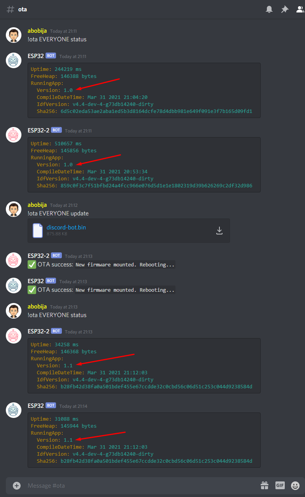

# ESP32 Discord bot OTA multiple update

This is example application which represent [ESP32 Discord bot](https://github.com/abobija/esp-discord) that can perform OTA updates on multiple ESP32 devices at once.

## Configuration steps:

- Run `./components/esp-discord/certgen.sh` to generate discord certificates
- Run `idf.py set-target esp32`
- Open `idf.py menuconfig` and set next configs:
  - `Partition Table`
    - \> `Partition Table`
      - \> `Factory app, two OTA definitions`
  - `Example Connection Configuration`
    - \> `WiFi SSID` with your wifi name
    - \> `WiFi Password` with you wifi password
  - `Component Config` > `Discord` > `Token` with your bot authentication token
- Now build, flash and monitor app.

For more examples please visit [esp-discord-examples](https://github.com/abobija/esp-discord-examples) repository or check out official [esp-discord](https://github.com/abobija/esp-discord) component repository.

## Demonstration video

## Demo

