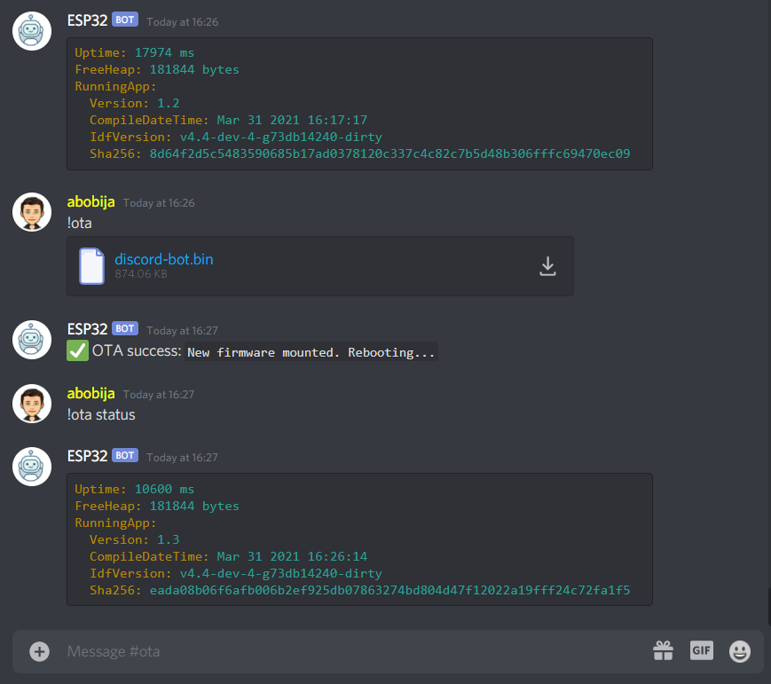

# ESP32 Discord bot OTA update

This is example application which represent [ESP32 Discord bot](https://github.com/abobija/esp-discord) that can perform OTA updates.

## Configuration steps:

- Run `./components/esp-discord/certgen.sh` to generate discord certificates
- Run `idf.py set-target esp32`
- Open `idf.py menuconfig` and set next configs:
  - `Partition Table`
    - \> `Partition Table`
      - \> `Factory app, two OTA definitions`
  - `Example Connection Configuration`
    - \> `WiFi SSID` with your wifi name
    - \> `WiFi Password` with you wifi password
  - `Component Config` > `Discord` > `Token` with your bot authentication token
- Now build, flash and monitor app.

For more examples please visit [esp-discord-examples](https://github.com/abobija/esp-discord-examples) repository or check out official [esp-discord](https://github.com/abobija/esp-discord) component repository.

## Demo



Output:

```
I (7055) discord_bot: Bot ESP32#9116 connected (session_id=2dfbe4a310a55bad9d3a5e0b0dbe212b)
I (18505) discord_bot: New message (content=!ota status, autor=abobija#5474, bot=false, attachments_len=0, channel=826475710482350080, dm=false, guild=805838862634451014)
I (73105) discord_bot: New message (content=!ota, autor=abobija#5474, bot=false, attachments_len=1, channel=826475710482350080, dm=false, guild=805838862634451014)
I (73115) DISCORD: discord_ota: Checking admin permissions...
I (73425) DISCORD: discord_ota: Gathering new firmware informations...
I (76595) DISCORD: ota_image: Firmware versions(new=1.3, running=1.2, last_invalid=NULL)
I (76595) DISCORD: ota_download_handler: Firmware downloading (size=895040 B)...
I (78285) DISCORD: ota_download_handler: Downloaded 9%
I (79875) DISCORD: ota_download_handler: Downloaded 18%
I (81755) DISCORD: ota_download_handler: Downloaded 27%
I (84105) DISCORD: ota_download_handler: Downloaded 36%
I (86465) DISCORD: ota_download_handler: Downloaded 45%
I (88735) DISCORD: ota_download_handler: Downloaded 54%
I (91115) DISCORD: ota_download_handler: Downloaded 63%
I (93455) DISCORD: ota_download_handler: Downloaded 72%
I (95805) DISCORD: ota_download_handler: Downloaded 81%
I (98215) DISCORD: ota_download_handler: Downloaded 90%
I (100565) DISCORD: ota_download_handler: Downloaded 99%
I (100725) DISCORD: ota_download_handler: Downloaded 100%
I (100725) DISCORD: discord_ota: Validating...
I (100735) esp_image: segment 0: paddr=00110020 vaddr=3f400020 size=2187ch (137340) map
I (100785) esp_image: segment 1: paddr=001318a4 vaddr=3ffb0000 size=042b0h ( 17072)
I (100785) esp_image: segment 2: paddr=00135b5c vaddr=40080000 size=0a4bch ( 42172)
I (100805) esp_image: segment 3: paddr=00140020 vaddr=400d0020 size=9f160h (651616) map
I (101015) esp_image: segment 4: paddr=001df188 vaddr=4008a4bc size=0b68ch ( 46732)
I (101025) DISCORD: discord_ota: Mounting...
I (101025) esp_image: segment 0: paddr=00110020 vaddr=3f400020 size=2187ch (137340) map
I (101075) esp_image: segment 1: paddr=001318a4 vaddr=3ffb0000 size=042b0h ( 17072)
I (101085) esp_image: segment 2: paddr=00135b5c vaddr=40080000 size=0a4bch ( 42172)
I (101095) esp_image: segment 3: paddr=00140020 vaddr=400d0020 size=9f160h (651616) map
I (101305) esp_image: segment 4: paddr=001df188 vaddr=4008a4bc size=0b68ch ( 46732)
I (101345) DISCORD: discord_ota: New firmware mounted. Rebooting...
```
