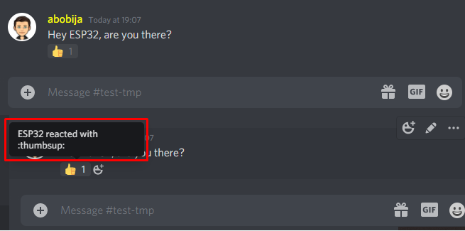

# ESP32 react Discord bot

This is example application which represent react [ESP32 Discord bot](https://github.com/abobija/esp-discord).

## Configuration steps:

- Run `./components/esp-discord/certgen.sh` to generate discord certificates
- Run `idf.py set-target esp32`
- Open `idf.py menuconfig` and set next configs:
  - `Example Connection Configuration`
    - \> `WiFi SSID` with your wifi name
    - \> `WiFi Password` with you wifi password
  - `Component Config` > `Discord` > `Token` with your bot authentication token
- Now build, flash and monitor app.

For more examples please visit [esp-discord-examples](https://github.com/abobija/esp-discord-examples) repository or check out official [esp-discord](https://github.com/abobija/esp-discord) component repository.

## Demo



Output:

```
I (7998) discord_bot: Bot ESP32#9421 connected
I (28988) discord_bot: New message (dm=false, autor=abobija#5474, bot=false, channel=808419120159916042, guild=805838862
634451014, content=Hey ESP32, are you there?)
I (31958) discord_bot: Reacted to message
```